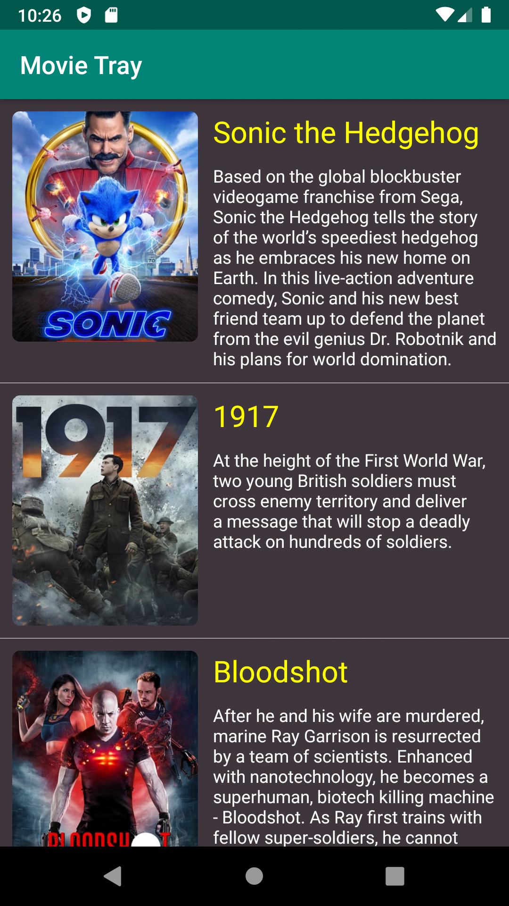
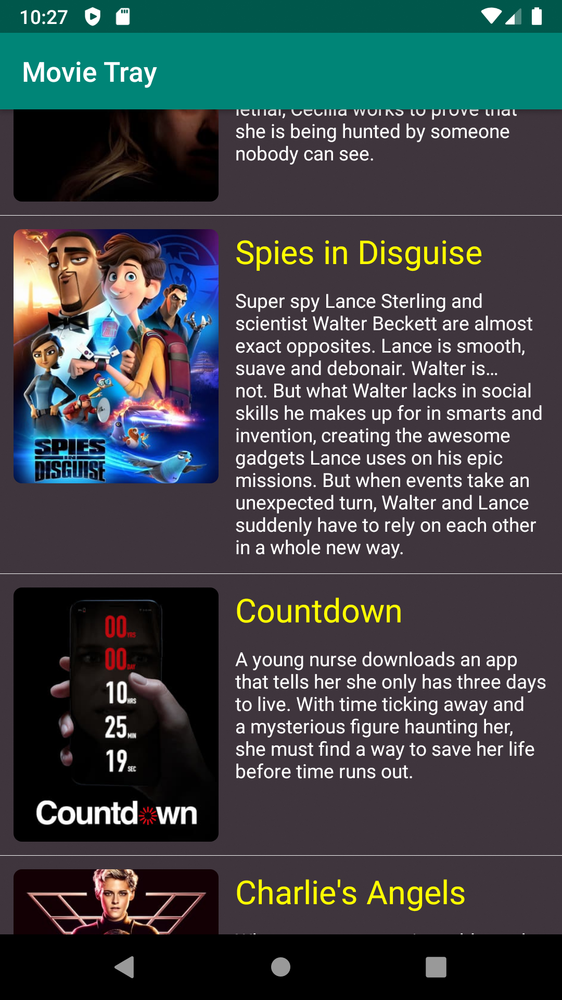
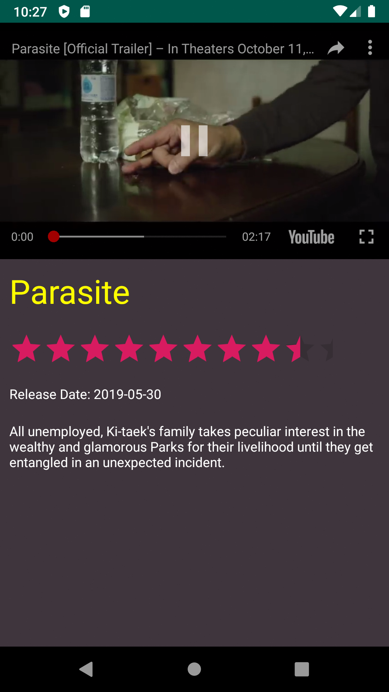

# Movie Tray
*Simple movies app that lets users discover newly released movies, using TMDb API. User can see the description, release date and the trailer of each movie.*

Download it on Google Play:

Screenshots:

  

*Special thanks to <a href="https://www.codepath.org" target="_blank">Codepath.org</a> for their amazing courses*
